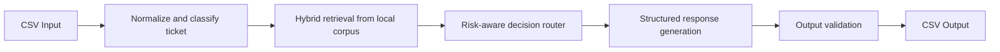
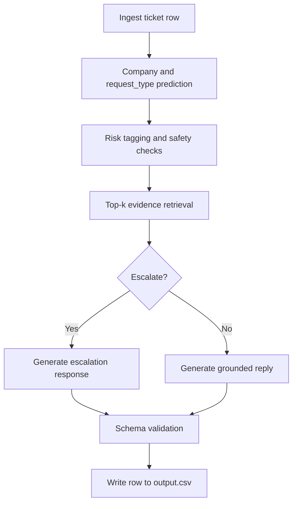

# HackerRank Orchestrate - Multi-Domain Support Triage Agent

Production-style support triage agent built for the HackerRank Orchestrate challenge.
It classifies tickets, routes risk-sensitive issues, retrieves grounded evidence from a local corpus, and generates safe responses for three ecosystems:

- HackerRank
- Claude
- Visa

## Overview

This project solves a CSV-to-CSV triage workflow:

- **Input:** `support_tickets/support_tickets.csv`
- **Output:** `support_tickets/output.csv`
- **Knowledge source:** local markdown corpus under `data/` only

Each ticket is mapped to:

- `status` (`replied` or `escalated`)
- `product_area`
- `response`
- `justification`
- `request_type` (`product_issue`, `feature_request`, `bug`, `invalid`)

---

## Architecture



### Pipeline details



---

## Repository Structure

```text
.
├── README.md
├── problem_statement.md
├── AGENTS.md
├── data/
│   ├── hackerrank/
│   ├── claude/
│   └── visa/
├── support_tickets/
│   ├── sample_support_tickets.csv
│   ├── support_tickets.csv
│   └── output.csv
└── code/
    ├── main.py
    ├── build_index.py
    ├── classifier.py
    ├── retriever.py
    ├── router.py
    ├── responder.py
    ├── validator.py
    ├── schemas.py
    ├── requirements.txt
    └── README.md
```

---

## How It Works

1. **Read input CSV** with ticket text, subject, and optional company hint.
2. **Classify intent** into the required request type.
3. **Retrieve evidence** from the relevant company corpus.
4. **Apply escalation policy** for high-risk or unsupported requests.
5. **Generate response and justification** from retrieved evidence only.
6. **Validate schema and enums** before writing final CSV rows.

---

## Quickstart

### 1) Clone and setup

```bash
git clone <your-fork-url>
cd hackerrank-orchestrate-may26
python -m venv .venv
source .venv/bin/activate
pip install -r code/requirements.txt
```

### 2) Configure environment

Create a local `.env` (already ignored by git) and set required keys:

```bash
OPENAI_API_KEY=...
ANTHROPIC_API_KEY=...
```

### 3) Build retrieval index

```bash
python code/build_index.py
```

### 4) Run end-to-end triage

```bash
python code/main.py \
  --in support_tickets/support_tickets.csv \
  --out support_tickets/output.csv
```

---

## Design Principles

- **Grounded responses only:** no claims outside `data/`.
- **Safety first:** uncertain or high-risk cases are escalated.
- **Deterministic behavior:** stable outputs where possible.
- **Structured outputs:** strict schema for reliable scoring and automation.

---

## Notes for GitHub Viewers

- The challenge is complete; this repository is now maintained as a public reference implementation.
- Core implementation details and run commands for developers are in `code/README.md`.
- Publishing and cleanup instructions are in `GITHUB_PUBLISHING.md`.