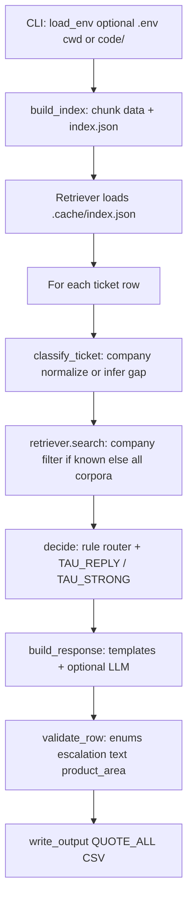

# Design — Support Triage Agent

## What this system does

The agent reads rows from an input CSV (`issue`, `subject`, `company`), builds or reuses an offline index of Markdown under `data/`, assigns labels and retrieves evidence against the inferred or given company, applies a deterministic escalation policy, then emits a grounded customer reply or the fixed escalation phrase plus `product_area`, `status`, `request_type`, and `justification`. Optional phrasing polish uses Groq (`openai` client) **only after** routing; it cannot unblock an escalation. Validation normalizes enums, product-area vocabulary, and CSV-safe text before write.

Implementation entry point: `main.py` (`process_ticket`, `run`).

## Architecture

| Stage | Module | Role |
| --- | --- | --- |
| **Index build** | `build_index.py`, `ingest.py` | Hash `data/*.md`; if unchanged, reuse `code/.cache/index.json`. Else chunk Markdown, derive `company`/`product_area`, precompute sparse TF–IDF vectors, BM25 term stats, corpus IDF. |
| **Classification** | `classifier.py`, `ingest.normalize_company` | Normalize CSV `company`; if empty, infer company via per-company top-1 retrieval scores and accept only if lead margin ≥ **0.08** (`infer_company`). Deterministic `request_type` + keyword `risk_tags`. |
| **Retrieval** | `retriever.py` | Hybrid BM25 + cosine TF–IDF; optional `translate_for_retrieval` query expansion. When `classification.company` is set, filter chunks to that company; when empty, **`main.process_ticket`** passes `company=""` so all corpora compete (no filter). |
| **Routing** | `router.py` | `decide()`: escalation rules first; uses `max_score(chunks)` vs **`TAU_REPLY`** (`0.52`) and **`TAU_STRONG`** (`0.68`) for the Visa fraud/theft auto-reply branch. |
| **Response** | `responder.py` | Escalation / invalid branches short-circuit. Otherwise `targeted_response` templates, then optional `LLMProvider.complete_json`. |
| **Validation** | `validator.py` | Coerce `status`/`request_type`; force escalation response text; clamp justification; fuzzy-normalize `product_area` vs `schemas.PRODUCT_AREAS`. |

## Decision rationale (design tradeoffs)

### Why escalation is rule-based and runs before the LLM

`main.py` calls `decide()` before `build_response()`. The router treats high-risk intents (outage, security disclosure, unresolved company, refunds, legal hooks, shallow retrieval) as **human-only** regardless of fluent model output. That keeps behavior explainable under interview and prevents the generator from overriding policy. **Tradeoff:** nuanced edge cases that a human could answer with docs still escalate when a keyword fires; tuning is brittle compared to learned routing.

### Why BM25 and TF–IDF instead of vector embeddings

`build_index.py` stores per-chunk IDF weighted sparse vectors (`utils.text.build_idf`, `tfidf_vector`) and BM25 counts (`Retriever.bm25`). No embedding API or GPU is required; the evaluator run matches a **fully local** corpus. BM25 dominates exact jargon (numbers, product names); cosine TF–IDF adds soft overlap. **Tradeoff:** no semantic synonyms beyond what overlaps tokens and the small retrieval query expansion (`utils/lang.translate_for_retrieval`); semantically equivalent wording with disjoint tokens retrieves poorly.

### Why classification of company, `product_area`, and `request_type` is deterministic before the LLM

`classify_ticket` sets `company` (or infers via retrieval spread) and `request_type`/`risk_tags` with regex/substrings so `retriever.search` can scope chunks when a company is resolved (`company` filter when non-empty; **all corpora** when still empty). `choose_product_area` in `responder.py` overlays keyword→area shortcuts per company before falling back to `best_area_from_chunks` (top hit’s chunk metadata). Keeping this out of the LLM avoids variable labels, leaking path names in JSON, and non-reproducible routing. **Tradeoff:** misclassification blows retrieval (wrong corpus slice or noisy cross-corpus hits when company is unknown); ambiguous tickets follow keyword false positives.

### What the LLM is used for and what constraints apply

Used only inside `build_response` when `LLMProvider` is constructed (`providers.py`). It receives ticket text plus up to **five** truncated chunks (~1200 chars each) as user content; **`prompts/respond.md`** is the system message. The API uses `temperature=0`, `response_format=json_object`, `max_tokens=700`, `seed=7`. Parsed JSON fills `response` and `justification` if constraints pass (`responder`: response kept only if non-empty and **≤ 240 words**; justification replaces fallback when non-empty string). **`complete_json` returns `{}`** if `GROQ_API_KEY` is unset—no HTTP call—so offline runs behave like “no LLM.” **Tradeoff:** model can still paraphrase wrong if sources are weak; system prompt forbids invented contacts but verification is prompt-only.

### Fallback chain when the LLM fails or rate-limits

For non-escalated, non-invalid rows:

1. **Base reply:** `targeted_response(...)` — hand-authored English templates for recurring Visa/HackerRank/Claude shapes; otherwise first retrieved chunk clipped via `first_sentence`.
2. **Base justification:** `_fallback_justification(...)` — sentence built from inferred `company`, `request_type`, and router `reason` (deterministic).
3. **If provider exists:** `try: provider.complete_json(prompt)` → on **any** `Exception`, `generated = {}` (`responder.py`).
4. Merge: non-empty trimmed `generated["response"`] under word cap replaces reply; non-empty trimmed `generated["justification"]` replaces justification.

Escalated rows never call the LLM; invalid rows use `invalid_response` + fixed invalid justification (`responder.py`).

### Provider configuration via environment variables

Loaded by `main.load_env()` from `./.env` or `code/.env` (`setdefault`, first wins):

| Variable | Effect |
| --- | --- |
| `GROQ_API_KEY` | If non-empty after strip, `select_provider` returns `LLMProvider` even when `--use-llm` is not passed (`main.py`). |
| `GROQ_MODEL` | Model ID passed to Groq each call; fallback `llama-3.3-70b-versatile` (`providers._env_model` / `complete_json`). |
| `GROQ_BASE_URL` | API base URL; fallback `https://api.groq.com/openai/v1`, resolved each request (`providers`). |
| `--use-llm` | Forces provider instantiation when key empty (caller still gets empty completions without key). |

`ProviderConfig` holds HTTP `timeout` and `temperature=0`; `GROQ_MODEL` and `GROQ_BASE_URL` are read in `complete_json` (or overridden by explicit non-empty ``ProviderConfig.model`` / ``base_url`` for tests).

## Retrieval details

### Corpus ingest and chunking (`ingest.py`)

- Walk `data/hackerrank`, `data/claude`, `data/visa`; skip every `index.md`.
- Strip frontmatter, images, tags; normalize Unicode (`clean_markdown` / `normalize_text`).
- Split on Markdown headings `#` … `######` (`heading_sections`).
- Within each heading section split on **word** windows: **`sliding_windows` size `620`, overlap `90` words** (`ingest.sliding_windows`).
- Drop windows with **`tokenize(window)` length &lt; 8** tokens.
- **`product_area_for_path`** maps path prefixes (and Claude special cases involving “private/delete/temporary”) to slugs constrained to **`schemas.PRODUCT_AREAS`**; mismatches clamp to company’s first allowed area (`build_chunks`).
- Persist chunk records with `tokens` from **`utils.text.tokenize`**.

### Index artifact (`build_index.py`)

Writes `code/.cache/index.json` with keys: `chunks`, corpus-wide `idf` (`build_idf` with \( \ln((N+1)/(df+1)) + 1 \)), sparse `doc_vectors`, per-doc `Counter` frequencies for BM25 (`doc_freqs`), `doc_lengths`, `avg_doc_length`, `data_hash` for invalidation (`ingest.data_hash`).

### Scoring (`retriever.Retriever.search`)

1. Optionally append English scaffold words for French/Spanish “card blocked” wording (`translate_for_retrieval`).
2. Tokenize query; sparse query vector via `tfidf_vector(tokens, idf)`.
3. For each chunk: **`if company and chunk.company != company: continue`** — hard company filter once `classification.company` is set.
4. BM25 (`k1=1.5`, `b=0.75`, Okapi form in code) and cosine similarity between sparse TF–IDF vectors.
5. Keep candidates with either score &gt; 0; **min–max normalize** BM25 and cosine lists separately; **hybrid = `0.55` × norm_bm25 + `0.45` × norm_cosine** (`bm25_weight` default).
6. Sort by hybrid descending; return top **`top_k` (default 5)** as `RetrievedChunk` with raw and hybrid scores stored.

### Company inference (`infer_company`)

Runs `search` per company with `top_k=1`, sorts hybrid scores, returns best company and **margin** between first and second; classifier requires **margin ≥ 0.08** to adopt inference; else sets `cross_domain=True` and empty `company`.

## Escalation rules (`router.decide`)

Evaluated in order below; first match wins (early rules shadow later ones). **`TAU_REPLY = 0.52`**: `low_evidence = (max chunk hybrid score < TAU_REPLY)`. **`TAU_STRONG = 0.68`**: stricter floor used only for the Visa `fraud_or_theft` auto-reply branch (rule 8)—requires stronger retrieval before scripting loss/stolen guidance vs escalating.

| Order | Trigger | Decision | Why it exists |
| --- | --- | --- | --- |
| 1 | `request_type == invalid` | `replied`, `invalid_or_out_of_scope` | Router does not escalate junk/greetings; responder handles copy. |
| 2 | `outage` risk tag | `escalated`, `possible_platform_outage` | Broad outage language needs live ops, not doc paraphrase. |
| 3 | `cross_domain` and still no `company` | `escalated`, `unresolved_company` | Avoid answering across the wrong product line. |
| 4 | `security_vuln` tag | `escalated`, `security_vulnerability` | Responsible disclosure path is not self-serve text. |
| 5 | `account_access` tag **and** text contains `restore my access` / `not the workspace owner` / `removed my seat` | `escalated`, `account_access_requires_admin` | Seat/workspace recovery needs an authorized admin. |
| 6 | `billing_refund` tag **and** refund/chargeback-style phrases; **unless** corpus contains both `bedrock` and `non-refundable` in concatenated chunks | `escalated` (`billing_refund_or_chargeback`) else `replied` (`grounded_bedrock_refund_policy`) | Billing and chargebacks need human adjudication unless policy is explicitly grounded for Bedrock. |
| 7 | `legal_privacy` tag **and** `stop crawling` / `legal` / `gdpr` in text | `escalated`, `legal_or_privacy_sensitive` | Legal interpretation risk. |
| 8 | `fraud_or_theft` tag | If `company == visa` **and** chunks exist **and** `top_score >= TAU_STRONG` (`0.68`): `replied` (`visa_lost_stolen_or_identity_guidance`); else `escalated` (`fraud_or_theft_without_grounding`) | Visa loss/theft uses a **higher** evidence bar than generic replies; weaker matches escalate. |
| 9 | `low_evidence` | `escalated`, `low_retrieval_evidence` | Prevent confident hallucination below score floor. |
| 10 | (default) | `replied`, `grounded_answer_available` | Normal doc-backed answer path. |

Escalated user-facing reply is **`ESCALATION_RESPONSE`** (`schemas`: `"Escalate to a human"`), enforced again in **`validator.validate_row`**.

## Honest limitations

- **Keyword brittleness:** `request_type` and `risk_tags` are substring/regex lists (`classifier.py`); synonyms and polite rephrases miss escalations or over-bucket bugs/features.
- **Cross-corpus retrieval when `company` is empty:** `main.process_ticket` now searches **all** chunks, so the top hits may belong to the wrong product until a company is inferred or the ticket is escalated—better than no context, but **`product_area`** and LLM grounding can pick the wrong silo.
- **Template vs sources conflict:** `targeted_response` can return fixed Visa phone numbers independent of retrieved chunk overlap; acceptable for known paths but violates strict “answer only top chunk” mental model unless LLM rewrote from sources.
- **LLM grounding is soft:** Retry/validation of citations is not programmatic; Groq rate limits/errors silently fall back to templates (`try/except` swallows all exceptions).
- **Product-area vocabulary:** Resolved via heuristics + top chunk metadata + **`difflib.get_close_matches` (cutoff 0.55)** in `validator.py`; evaluator labels may diverge where chunks disagree with ticket intent.

## Traceability

Every behavioral claim above maps to: `main.py`, `ingest.py`, `build_index.py`, `retriever.py`, `classifier.py`, `router.py`, `responder.py`, `validator.py`, `providers.py`, `schemas.py`, `utils/text.py`, `utils/lang.py`, `utils/csv_io.py`, and `prompts/respond.md`.
